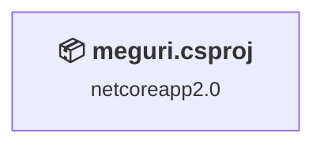
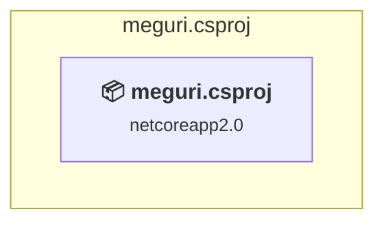

# Projects and dependencies analysis

This document provides a comprehensive overview of the projects and their dependencies in the context of upgrading to .NETCoreApp,Version=v10.0.

## Table of Contents

- [Executive Summary](#executive-Summary)
  - [Highlevel Metrics](#highlevel-metrics)
  - [Projects Compatibility](#projects-compatibility)
  - [Package Compatibility](#package-compatibility)
  - [API Compatibility](#api-compatibility)
  - [Binding Redirect Configuration](#binding-redirect-configuration)
- [Aggregate NuGet packages details](#aggregate-nuget-packages-details)
- [Top API Migration Challenges](#top-api-migration-challenges)
  - [Technologies and Features](#technologies-and-features)
  - [Most Frequent API Issues](#most-frequent-api-issues)
- [Projects Relationship Graph](#projects-relationship-graph)
- [Project Details](#project-details)

  - [meguri\meguri.csproj](#megurimeguricsproj)

## Executive Summary

### Highlevel Metrics

| Metric | Count | Status |
| :--- | :---: | :--- |
| Total Projects | 1 | All require upgrade |
| Total NuGet Packages | 310 | 4 need upgrade |
| Total Code Files | 67 |  |
| Total Code Files with Incidents | 3 |  |
| Total Lines of Code | 3275 |  |
| Total Number of Issues | 17 |  |
| Estimated LOC to modify | 10+ | at least 0.3% of codebase |

### Projects Compatibility

| Project | Target Framework | Difficulty | Package Issues | API Issues | Binding Issues | Est. LOC Impact | Description |
| :--- | :---: | :---: | :---: | :---: | :---: | :---: | :--- |
| [meguri\meguri.csproj](#megurimeguricsproj) | netcoreapp2.0 | 🟢 Low | 6 | 10 | 0 | 10+ | AspNetCore, Sdk Style = True |

### Package Compatibility

| Status | Count | Percentage |
| :--- | :---: | :---: |
| ✅ Compatible | 306 | 98.7% |
| ⚠️ Incompatible | 1 | 0.3% |
| 🔄 Upgrade Recommended | 3 | 1.0% |
| ***Total NuGet Packages*** | ***310*** | ***100%*** |

### API Compatibility

| Category | Count | Impact |
| :--- | :---: | :--- |
| 🔴 Binary Incompatible | 0 | High - Require code changes |
| 🟡 Source Incompatible | 9 | Medium - Needs re-compilation and potential conflicting API error fixing |
| 🔵 Behavioral change | 1 | Low - Behavioral changes that may require testing at runtime |
| ✅ Compatible | 2659 |  |
| ***Total APIs Analyzed*** | ***2669*** |  |

## Aggregate NuGet packages details

| Package | Current Version | Suggested Version | Projects | Description |
| :--- | :---: | :---: | :--- | :--- |
| Libuv | 1.10.0 |  | [meguri.csproj](#megurimeguricsproj) | ✅Compatible |
| Microsoft.ApplicationInsights | 2.4.0 |  | [meguri.csproj](#megurimeguricsproj) | ✅Compatible |
| Microsoft.ApplicationInsights.AspNetCore | 2.1.1 |  | [meguri.csproj](#megurimeguricsproj) | ✅Compatible |
| Microsoft.ApplicationInsights.DependencyCollector | 2.4.1 |  | [meguri.csproj](#megurimeguricsproj) | ✅Compatible |
| Microsoft.AspNetCore | 2.0.4 |  | [meguri.csproj](#megurimeguricsproj) | ✅Compatible |
| Microsoft.AspNetCore.All | 2.0.9 |  | [meguri.csproj](#megurimeguricsproj) | ⚠️NuGet パッケージは非推奨です |
| Microsoft.AspNetCore.Antiforgery | 2.0.3 |  | [meguri.csproj](#megurimeguricsproj) | ✅Compatible |
| Microsoft.AspNetCore.ApplicationInsights.HostingStartup | 2.0.4 |  | [meguri.csproj](#megurimeguricsproj) | ✅Compatible |
| Microsoft.AspNetCore.Authentication | 2.0.4 |  | [meguri.csproj](#megurimeguricsproj) | ✅Compatible |
| Microsoft.AspNetCore.Authentication.Abstractions | 2.0.3 |  | [meguri.csproj](#megurimeguricsproj) | ✅Compatible |
| Microsoft.AspNetCore.Authentication.Cookies | 2.0.4 |  | [meguri.csproj](#megurimeguricsproj) | ✅Compatible |
| Microsoft.AspNetCore.Authentication.Core | 2.0.3 |  | [meguri.csproj](#megurimeguricsproj) | ✅Compatible |
| Microsoft.AspNetCore.Authentication.Facebook | 2.0.4 |  | [meguri.csproj](#megurimeguricsproj) | ✅Compatible |
| Microsoft.AspNetCore.Authentication.Google | 2.0.4 |  | [meguri.csproj](#megurimeguricsproj) | ✅Compatible |
| Microsoft.AspNetCore.Authentication.JwtBearer | 2.0.4 |  | [meguri.csproj](#megurimeguricsproj) | ✅Compatible |
| Microsoft.AspNetCore.Authentication.MicrosoftAccount | 2.0.4 |  | [meguri.csproj](#megurimeguricsproj) | ✅Compatible |
| Microsoft.AspNetCore.Authentication.OAuth | 2.0.4 |  | [meguri.csproj](#megurimeguricsproj) | ✅Compatible |
| Microsoft.AspNetCore.Authentication.OpenIdConnect | 2.0.4 |  | [meguri.csproj](#megurimeguricsproj) | ✅Compatible |
| Microsoft.AspNetCore.Authentication.Twitter | 2.0.4 |  | [meguri.csproj](#megurimeguricsproj) | ✅Compatible |
| Microsoft.AspNetCore.Authorization | 2.0.4 |  | [meguri.csproj](#megurimeguricsproj) | ✅Compatible |
| Microsoft.AspNetCore.Authorization.Policy | 2.0.4 |  | [meguri.csproj](#megurimeguricsproj) | ✅Compatible |
| Microsoft.AspNetCore.AzureAppServices.HostingStartup | 2.0.4 |  | [meguri.csproj](#megurimeguricsproj) | ✅Compatible |
| Microsoft.AspNetCore.AzureAppServicesIntegration | 2.0.4 |  | [meguri.csproj](#megurimeguricsproj) | ✅Compatible |
| Microsoft.AspNetCore.CookiePolicy | 2.0.4 |  | [meguri.csproj](#megurimeguricsproj) | ✅Compatible |
| Microsoft.AspNetCore.Cors | 2.0.3 |  | [meguri.csproj](#megurimeguricsproj) | ✅Compatible |
| Microsoft.AspNetCore.Cryptography.Internal | 2.0.3 |  | [meguri.csproj](#megurimeguricsproj) | ✅Compatible |
| Microsoft.AspNetCore.Cryptography.KeyDerivation | 2.0.3 |  | [meguri.csproj](#megurimeguricsproj) | ✅Compatible |
| Microsoft.AspNetCore.DataProtection | 2.0.3 |  | [meguri.csproj](#megurimeguricsproj) | ✅Compatible |
| Microsoft.AspNetCore.DataProtection.Abstractions | 2.0.3 |  | [meguri.csproj](#megurimeguricsproj) | ✅Compatible |
| Microsoft.AspNetCore.DataProtection.AzureStorage | 2.0.3 |  | [meguri.csproj](#megurimeguricsproj) | ✅Compatible |
| Microsoft.AspNetCore.DataProtection.Extensions | 2.0.3 |  | [meguri.csproj](#megurimeguricsproj) | ✅Compatible |
| Microsoft.AspNetCore.Diagnostics | 2.0.3 |  | [meguri.csproj](#megurimeguricsproj) | ✅Compatible |
| Microsoft.AspNetCore.Diagnostics.Abstractions | 2.0.3 |  | [meguri.csproj](#megurimeguricsproj) | ✅Compatible |
| Microsoft.AspNetCore.Diagnostics.EntityFrameworkCore | 2.0.3 |  | [meguri.csproj](#megurimeguricsproj) | ✅Compatible |
| Microsoft.AspNetCore.Hosting | 2.0.3 |  | [meguri.csproj](#megurimeguricsproj) | ✅Compatible |
| Microsoft.AspNetCore.Hosting.Abstractions | 2.0.3 |  | [meguri.csproj](#megurimeguricsproj) | ✅Compatible |
| Microsoft.AspNetCore.Hosting.Server.Abstractions | 2.0.3 |  | [meguri.csproj](#megurimeguricsproj) | ✅Compatible |
| Microsoft.AspNetCore.Html.Abstractions | 2.0.2 |  | [meguri.csproj](#megurimeguricsproj) | ✅Compatible |
| Microsoft.AspNetCore.Http | 2.0.3 |  | [meguri.csproj](#megurimeguricsproj) | ✅Compatible |
| Microsoft.AspNetCore.Http.Abstractions | 2.0.3 |  | [meguri.csproj](#megurimeguricsproj) | ✅Compatible |
| Microsoft.AspNetCore.Http.Extensions | 2.0.3 |  | [meguri.csproj](#megurimeguricsproj) | ✅Compatible |
| Microsoft.AspNetCore.Http.Features | 2.0.3 |  | [meguri.csproj](#megurimeguricsproj) | ✅Compatible |
| Microsoft.AspNetCore.HttpOverrides | 2.0.3 |  | [meguri.csproj](#megurimeguricsproj) | ✅Compatible |
| Microsoft.AspNetCore.Identity | 2.0.4 |  | [meguri.csproj](#megurimeguricsproj) | ✅Compatible |
| Microsoft.AspNetCore.Identity.EntityFrameworkCore | 2.0.4 |  | [meguri.csproj](#megurimeguricsproj) | ✅Compatible |
| Microsoft.AspNetCore.JsonPatch | 2.0.0 |  | [meguri.csproj](#megurimeguricsproj) | ✅Compatible |
| Microsoft.AspNetCore.Localization | 2.0.3 |  | [meguri.csproj](#megurimeguricsproj) | ✅Compatible |
| Microsoft.AspNetCore.Localization.Routing | 2.0.3 |  | [meguri.csproj](#megurimeguricsproj) | ✅Compatible |
| Microsoft.AspNetCore.MiddlewareAnalysis | 2.0.3 |  | [meguri.csproj](#megurimeguricsproj) | ✅Compatible |
| Microsoft.AspNetCore.Mvc | 2.0.4 |  | [meguri.csproj](#megurimeguricsproj) | ✅Compatible |
| Microsoft.AspNetCore.Mvc.Abstractions | 2.0.4 |  | [meguri.csproj](#megurimeguricsproj) | ✅Compatible |
| Microsoft.AspNetCore.Mvc.ApiExplorer | 2.0.4 |  | [meguri.csproj](#megurimeguricsproj) | ✅Compatible |
| Microsoft.AspNetCore.Mvc.Core | 2.0.4 |  | [meguri.csproj](#megurimeguricsproj) | ✅Compatible |
| Microsoft.AspNetCore.Mvc.Cors | 2.0.4 |  | [meguri.csproj](#megurimeguricsproj) | ✅Compatible |
| Microsoft.AspNetCore.Mvc.DataAnnotations | 2.0.4 |  | [meguri.csproj](#megurimeguricsproj) | ✅Compatible |
| Microsoft.AspNetCore.Mvc.Formatters.Json | 2.0.4 |  | [meguri.csproj](#megurimeguricsproj) | ✅Compatible |
| Microsoft.AspNetCore.Mvc.Formatters.Xml | 2.0.4 |  | [meguri.csproj](#megurimeguricsproj) | ✅Compatible |
| Microsoft.AspNetCore.Mvc.Localization | 2.0.4 |  | [meguri.csproj](#megurimeguricsproj) | ✅Compatible |
| Microsoft.AspNetCore.Mvc.Razor | 2.0.4 |  | [meguri.csproj](#megurimeguricsproj) | ✅Compatible |
| Microsoft.AspNetCore.Mvc.Razor.Extensions | 2.0.3 |  | [meguri.csproj](#megurimeguricsproj) | ✅Compatible |
| Microsoft.AspNetCore.Mvc.Razor.ViewCompilation | 2.0.4 |  | [meguri.csproj](#megurimeguricsproj) | ✅Compatible |
| Microsoft.AspNetCore.Mvc.RazorPages | 2.0.4 |  | [meguri.csproj](#megurimeguricsproj) | ✅Compatible |
| Microsoft.AspNetCore.Mvc.TagHelpers | 2.0.4 |  | [meguri.csproj](#megurimeguricsproj) | ✅Compatible |
| Microsoft.AspNetCore.Mvc.ViewFeatures | 2.0.4 |  | [meguri.csproj](#megurimeguricsproj) | ✅Compatible |
| Microsoft.AspNetCore.NodeServices | 2.0.4 |  | [meguri.csproj](#megurimeguricsproj) | ✅Compatible |
| Microsoft.AspNetCore.Owin | 2.0.3 |  | [meguri.csproj](#megurimeguricsproj) | ✅Compatible |
| Microsoft.AspNetCore.Razor | 2.0.3 |  | [meguri.csproj](#megurimeguricsproj) | ✅Compatible |
| Microsoft.AspNetCore.Razor.Language | 2.0.3 |  | [meguri.csproj](#megurimeguricsproj) | ✅Compatible |
| Microsoft.AspNetCore.Razor.Runtime | 2.0.3 |  | [meguri.csproj](#megurimeguricsproj) | ✅Compatible |
| Microsoft.AspNetCore.ResponseCaching | 2.0.3 |  | [meguri.csproj](#megurimeguricsproj) | ✅Compatible |
| Microsoft.AspNetCore.ResponseCaching.Abstractions | 2.0.3 |  | [meguri.csproj](#megurimeguricsproj) | ✅Compatible |
| Microsoft.AspNetCore.ResponseCompression | 2.0.3 |  | [meguri.csproj](#megurimeguricsproj) | ✅Compatible |
| Microsoft.AspNetCore.Rewrite | 2.0.3 |  | [meguri.csproj](#megurimeguricsproj) | ✅Compatible |
| Microsoft.AspNetCore.Routing | 2.0.3 |  | [meguri.csproj](#megurimeguricsproj) | ✅Compatible |
| Microsoft.AspNetCore.Routing.Abstractions | 2.0.3 |  | [meguri.csproj](#megurimeguricsproj) | ✅Compatible |
| Microsoft.AspNetCore.Server.HttpSys | 2.0.4 |  | [meguri.csproj](#megurimeguricsproj) | ✅Compatible |
| Microsoft.AspNetCore.Server.IISIntegration | 2.0.3 |  | [meguri.csproj](#megurimeguricsproj) | ✅Compatible |
| Microsoft.AspNetCore.Server.Kestrel | 2.0.4 |  | [meguri.csproj](#megurimeguricsproj) | ✅Compatible |
| Microsoft.AspNetCore.Server.Kestrel.Core | 2.0.4 |  | [meguri.csproj](#megurimeguricsproj) | ✅Compatible |
| Microsoft.AspNetCore.Server.Kestrel.Https | 2.0.4 |  | [meguri.csproj](#megurimeguricsproj) | ✅Compatible |
| Microsoft.AspNetCore.Server.Kestrel.Transport.Abstractions | 2.0.4 |  | [meguri.csproj](#megurimeguricsproj) | ✅Compatible |
| Microsoft.AspNetCore.Server.Kestrel.Transport.Libuv | 2.0.4 |  | [meguri.csproj](#megurimeguricsproj) | ✅Compatible |
| Microsoft.AspNetCore.Session | 2.0.3 |  | [meguri.csproj](#megurimeguricsproj) | ✅Compatible |
| Microsoft.AspNetCore.SpaServices | 2.0.4 |  | [meguri.csproj](#megurimeguricsproj) | ✅Compatible |
| Microsoft.AspNetCore.StaticFiles | 2.0.3 |  | [meguri.csproj](#megurimeguricsproj) | ✅Compatible |
| Microsoft.AspNetCore.WebSockets | 2.0.3 |  | [meguri.csproj](#megurimeguricsproj) | ✅Compatible |
| Microsoft.AspNetCore.WebUtilities | 2.0.3 |  | [meguri.csproj](#megurimeguricsproj) | ✅Compatible |
| Microsoft.Azure.KeyVault | 2.3.2 |  | [meguri.csproj](#megurimeguricsproj) | ✅Compatible |
| Microsoft.Azure.KeyVault.WebKey | 2.0.7 |  | [meguri.csproj](#megurimeguricsproj) | ✅Compatible |
| Microsoft.CodeAnalysis.Analyzers | 1.1.0 |  | [meguri.csproj](#megurimeguricsproj) | ✅Compatible |
| Microsoft.CodeAnalysis.Common | 2.3.1 |  | [meguri.csproj](#megurimeguricsproj) | ✅Compatible |
| Microsoft.CodeAnalysis.CSharp | 2.3.1 |  | [meguri.csproj](#megurimeguricsproj) | ✅Compatible |
| Microsoft.CodeAnalysis.CSharp.Workspaces | 2.3.1 |  | [meguri.csproj](#megurimeguricsproj) | ✅Compatible |
| Microsoft.CodeAnalysis.Razor | 2.0.3 |  | [meguri.csproj](#megurimeguricsproj) | ✅Compatible |
| Microsoft.CodeAnalysis.Workspaces.Common | 2.3.1 |  | [meguri.csproj](#megurimeguricsproj) | ✅Compatible |
| Microsoft.CSharp | 4.4.0 |  | [meguri.csproj](#megurimeguricsproj) | ✅Compatible |
| Microsoft.Data.Edm | 5.8.2 |  | [meguri.csproj](#megurimeguricsproj) | ✅Compatible |
| Microsoft.Data.OData | 5.8.2 |  | [meguri.csproj](#megurimeguricsproj) | ✅Compatible |
| Microsoft.Data.Sqlite | 2.0.1 |  | [meguri.csproj](#megurimeguricsproj) | ✅Compatible |
| Microsoft.Data.Sqlite.Core | 2.0.1 |  | [meguri.csproj](#megurimeguricsproj) | ✅Compatible |
| Microsoft.DotNet.PlatformAbstractions | 2.0.3 |  | [meguri.csproj](#megurimeguricsproj) | ✅Compatible |
| Microsoft.EntityFrameworkCore | 2.0.3 |  | [meguri.csproj](#megurimeguricsproj) | ✅Compatible |
| Microsoft.EntityFrameworkCore.Design | 2.0.3 |  | [meguri.csproj](#megurimeguricsproj) | ✅Compatible |
| Microsoft.EntityFrameworkCore.InMemory | 2.0.3 |  | [meguri.csproj](#megurimeguricsproj) | ✅Compatible |
| Microsoft.EntityFrameworkCore.Relational | 2.0.3 |  | [meguri.csproj](#megurimeguricsproj) | ✅Compatible |
| Microsoft.EntityFrameworkCore.Sqlite | 2.0.3 |  | [meguri.csproj](#megurimeguricsproj) | ✅Compatible |
| Microsoft.EntityFrameworkCore.Sqlite.Core | 2.0.3 |  | [meguri.csproj](#megurimeguricsproj) | ✅Compatible |
| Microsoft.EntityFrameworkCore.SqlServer | 2.0.3 |  | [meguri.csproj](#megurimeguricsproj) | ✅Compatible |
| Microsoft.EntityFrameworkCore.Tools | 2.0.3 | 10.0.11 | [meguri.csproj](#megurimeguricsproj) | NuGet パッケージのアップグレードをおすすめします |
| Microsoft.Extensions.Caching.Abstractions | 2.0.2 |  | [meguri.csproj](#megurimeguricsproj) | ✅Compatible |
| Microsoft.Extensions.Caching.Memory | 2.0.2 |  | [meguri.csproj](#megurimeguricsproj) | ✅Compatible |
| Microsoft.Extensions.Caching.Redis | 2.0.2 |  | [meguri.csproj](#megurimeguricsproj) | ✅Compatible |
| Microsoft.Extensions.Caching.SqlServer | 2.0.2 |  | [meguri.csproj](#megurimeguricsproj) | ✅Compatible |
| Microsoft.Extensions.Configuration | 2.0.2 |  | [meguri.csproj](#megurimeguricsproj) | ✅Compatible |
| Microsoft.Extensions.Configuration.Abstractions | 2.0.2 |  | [meguri.csproj](#megurimeguricsproj) | ✅Compatible |
| Microsoft.Extensions.Configuration.AzureKeyVault | 2.0.2 |  | [meguri.csproj](#megurimeguricsproj) | ✅Compatible |
| Microsoft.Extensions.Configuration.Binder | 2.0.2 |  | [meguri.csproj](#megurimeguricsproj) | ✅Compatible |
| Microsoft.Extensions.Configuration.CommandLine | 2.0.2 |  | [meguri.csproj](#megurimeguricsproj) | ✅Compatible |
| Microsoft.Extensions.Configuration.EnvironmentVariables | 2.0.2 |  | [meguri.csproj](#megurimeguricsproj) | ✅Compatible |
| Microsoft.Extensions.Configuration.FileExtensions | 2.0.2 |  | [meguri.csproj](#megurimeguricsproj) | ✅Compatible |
| Microsoft.Extensions.Configuration.Ini | 2.0.2 |  | [meguri.csproj](#megurimeguricsproj) | ✅Compatible |
| Microsoft.Extensions.Configuration.Json | 2.0.2 |  | [meguri.csproj](#megurimeguricsproj) | ✅Compatible |
| Microsoft.Extensions.Configuration.UserSecrets | 2.0.2 |  | [meguri.csproj](#megurimeguricsproj) | ✅Compatible |
| Microsoft.Extensions.Configuration.Xml | 2.0.2 |  | [meguri.csproj](#megurimeguricsproj) | ✅Compatible |
| Microsoft.Extensions.DependencyInjection | 2.0.0 |  | [meguri.csproj](#megurimeguricsproj) | ✅Compatible |
| Microsoft.Extensions.DependencyInjection.Abstractions | 2.0.0 |  | [meguri.csproj](#megurimeguricsproj) | ✅Compatible |
| Microsoft.Extensions.DependencyModel | 2.0.3 |  | [meguri.csproj](#megurimeguricsproj) | ✅Compatible |
| Microsoft.Extensions.DiagnosticAdapter | 2.0.1 |  | [meguri.csproj](#megurimeguricsproj) | ✅Compatible |
| Microsoft.Extensions.FileProviders.Abstractions | 2.0.1 |  | [meguri.csproj](#megurimeguricsproj) | ✅Compatible |
| Microsoft.Extensions.FileProviders.Composite | 2.0.1 |  | [meguri.csproj](#megurimeguricsproj) | ✅Compatible |
| Microsoft.Extensions.FileProviders.Embedded | 2.0.1 |  | [meguri.csproj](#megurimeguricsproj) | ✅Compatible |
| Microsoft.Extensions.FileProviders.Physical | 2.0.1 |  | [meguri.csproj](#megurimeguricsproj) | ✅Compatible |
| Microsoft.Extensions.FileSystemGlobbing | 2.0.1 |  | [meguri.csproj](#megurimeguricsproj) | ✅Compatible |
| Microsoft.Extensions.Hosting.Abstractions | 2.0.3 |  | [meguri.csproj](#megurimeguricsproj) | ✅Compatible |
| Microsoft.Extensions.Identity.Core | 2.0.4 |  | [meguri.csproj](#megurimeguricsproj) | ✅Compatible |
| Microsoft.Extensions.Identity.Stores | 2.0.4 |  | [meguri.csproj](#megurimeguricsproj) | ✅Compatible |
| Microsoft.Extensions.Localization | 2.0.3 |  | [meguri.csproj](#megurimeguricsproj) | ✅Compatible |
| Microsoft.Extensions.Localization.Abstractions | 2.0.3 |  | [meguri.csproj](#megurimeguricsproj) | ✅Compatible |
| Microsoft.Extensions.Logging | 2.0.2 |  | [meguri.csproj](#megurimeguricsproj) | ✅Compatible |
| Microsoft.Extensions.Logging.Abstractions | 2.0.2 |  | [meguri.csproj](#megurimeguricsproj) | ✅Compatible |
| Microsoft.Extensions.Logging.AzureAppServices | 2.0.2 |  | [meguri.csproj](#megurimeguricsproj) | ✅Compatible |
| Microsoft.Extensions.Logging.Configuration | 2.0.2 |  | [meguri.csproj](#megurimeguricsproj) | ✅Compatible |
| Microsoft.Extensions.Logging.Console | 2.0.2 |  | [meguri.csproj](#megurimeguricsproj) | ✅Compatible |
| Microsoft.Extensions.Logging.Debug | 2.0.2 |  | [meguri.csproj](#megurimeguricsproj) | ✅Compatible |
| Microsoft.Extensions.Logging.EventSource | 2.0.2 |  | [meguri.csproj](#megurimeguricsproj) | ✅Compatible |
| Microsoft.Extensions.Logging.TraceSource | 2.0.2 |  | [meguri.csproj](#megurimeguricsproj) | ✅Compatible |
| Microsoft.Extensions.ObjectPool | 2.0.0 |  | [meguri.csproj](#megurimeguricsproj) | ✅Compatible |
| Microsoft.Extensions.Options | 2.0.2 |  | [meguri.csproj](#megurimeguricsproj) | ✅Compatible |
| Microsoft.Extensions.Options.ConfigurationExtensions | 2.0.2 |  | [meguri.csproj](#megurimeguricsproj) | ✅Compatible |
| Microsoft.Extensions.PlatformAbstractions | 1.1.0 |  | [meguri.csproj](#megurimeguricsproj) | ✅Compatible |
| Microsoft.Extensions.Primitives | 2.0.0 |  | [meguri.csproj](#megurimeguricsproj) | ✅Compatible |
| Microsoft.Extensions.WebEncoders | 2.0.2 |  | [meguri.csproj](#megurimeguricsproj) | ✅Compatible |
| Microsoft.IdentityModel.Clients.ActiveDirectory | 3.14.1 |  | [meguri.csproj](#megurimeguricsproj) | ✅Compatible |
| Microsoft.IdentityModel.Logging | 1.1.4 |  | [meguri.csproj](#megurimeguricsproj) | ✅Compatible |
| Microsoft.IdentityModel.Protocols | 2.1.4 |  | [meguri.csproj](#megurimeguricsproj) | ✅Compatible |
| Microsoft.IdentityModel.Protocols.OpenIdConnect | 2.1.4 |  | [meguri.csproj](#megurimeguricsproj) | ✅Compatible |
| Microsoft.IdentityModel.Tokens | 5.1.4 |  | [meguri.csproj](#megurimeguricsproj) | ✅Compatible |
| Microsoft.Net.Http.Headers | 2.0.3 |  | [meguri.csproj](#megurimeguricsproj) | ✅Compatible |
| Microsoft.NETCore.App | 2.0.0 | 2.2.8 | [meguri.csproj](#megurimeguricsproj) | NuGet パッケージにセキュリティの脆弱性が含まれています |
| Microsoft.NETCore.DotNetAppHost | 2.0.0 |  | [meguri.csproj](#megurimeguricsproj) | ✅Compatible |
| Microsoft.NETCore.DotNetHostPolicy | 2.0.0 |  | [meguri.csproj](#megurimeguricsproj) | ✅Compatible |
| Microsoft.NETCore.DotNetHostResolver | 2.0.0 |  | [meguri.csproj](#megurimeguricsproj) | ✅Compatible |
| Microsoft.NETCore.Platforms | 2.0.0 |  | [meguri.csproj](#megurimeguricsproj) | ✅Compatible |
| Microsoft.NETCore.Targets | 1.1.0 |  | [meguri.csproj](#megurimeguricsproj) | ✅Compatible |
| Microsoft.Rest.ClientRuntime | 2.3.8 |  | [meguri.csproj](#megurimeguricsproj) | ✅Compatible |
| Microsoft.Rest.ClientRuntime.Azure | 3.3.7 |  | [meguri.csproj](#megurimeguricsproj) | ✅Compatible |
| Microsoft.VisualStudio.Web.BrowserLink | 2.0.3 |  | [meguri.csproj](#megurimeguricsproj) | ✅Compatible |
| Microsoft.VisualStudio.Web.CodeGeneration | 2.0.4 |  | [meguri.csproj](#megurimeguricsproj) | ✅Compatible |
| Microsoft.VisualStudio.Web.CodeGeneration.Contracts | 2.0.4 |  | [meguri.csproj](#megurimeguricsproj) | ✅Compatible |
| Microsoft.VisualStudio.Web.CodeGeneration.Core | 2.0.4 |  | [meguri.csproj](#megurimeguricsproj) | ✅Compatible |
| Microsoft.VisualStudio.Web.CodeGeneration.Design | 2.0.4 | 10.0.2 | [meguri.csproj](#megurimeguricsproj) | NuGet パッケージのアップグレードをおすすめします |
| Microsoft.VisualStudio.Web.CodeGeneration.EntityFrameworkCore | 2.0.4 |  | [meguri.csproj](#megurimeguricsproj) | ✅Compatible |
| Microsoft.VisualStudio.Web.CodeGeneration.Templating | 2.0.4 |  | [meguri.csproj](#megurimeguricsproj) | ✅Compatible |
| Microsoft.VisualStudio.Web.CodeGeneration.Utils | 2.0.4 |  | [meguri.csproj](#megurimeguricsproj) | ✅Compatible |
| Microsoft.VisualStudio.Web.CodeGenerators.Mvc | 2.0.4 |  | [meguri.csproj](#megurimeguricsproj) | ✅Compatible |
| Microsoft.Win32.Primitives | 4.3.0 |  | [meguri.csproj](#megurimeguricsproj) | ✅Compatible |
| Microsoft.Win32.Registry | 4.4.0 |  | [meguri.csproj](#megurimeguricsproj) | ✅Compatible |
| NETStandard.Library | 2.0.0 |  | [meguri.csproj](#megurimeguricsproj) | ✅Compatible |
| Newtonsoft.Json | 10.0.1 |  | [meguri.csproj](#megurimeguricsproj) | ✅Compatible |
| Newtonsoft.Json.Bson | 1.0.1 |  | [meguri.csproj](#megurimeguricsproj) | ✅Compatible |
| NuGet.Frameworks | 4.0.0 |  | [meguri.csproj](#megurimeguricsproj) | ✅Compatible |
| Remotion.Linq | 2.1.1 |  | [meguri.csproj](#megurimeguricsproj) | ✅Compatible |
| runtime.debian.8-x64.runtime.native.System.Security.Cryptography.OpenSsl | 4.3.0 |  | [meguri.csproj](#megurimeguricsproj) | ✅Compatible |
| runtime.fedora.23-x64.runtime.native.System.Security.Cryptography.OpenSsl | 4.3.0 |  | [meguri.csproj](#megurimeguricsproj) | ✅Compatible |
| runtime.fedora.24-x64.runtime.native.System.Security.Cryptography.OpenSsl | 4.3.0 |  | [meguri.csproj](#megurimeguricsproj) | ✅Compatible |
| runtime.native.System | 4.3.0 |  | [meguri.csproj](#megurimeguricsproj) | ✅Compatible |
| runtime.native.System.Data.SqlClient.sni | 4.4.0 |  | [meguri.csproj](#megurimeguricsproj) | ✅Compatible |
| runtime.native.System.IO.Compression | 4.3.0 |  | [meguri.csproj](#megurimeguricsproj) | ✅Compatible |
| runtime.native.System.Net.Http | 4.3.0 |  | [meguri.csproj](#megurimeguricsproj) | ✅Compatible |
| runtime.native.System.Net.Security | 4.3.0 |  | [meguri.csproj](#megurimeguricsproj) | ✅Compatible |
| runtime.native.System.Security.Cryptography.Apple | 4.3.0 |  | [meguri.csproj](#megurimeguricsproj) | ✅Compatible |
| runtime.native.System.Security.Cryptography.OpenSsl | 4.3.0 |  | [meguri.csproj](#megurimeguricsproj) | ✅Compatible |
| runtime.opensuse.13.2-x64.runtime.native.System.Security.Cryptography.OpenSsl | 4.3.0 |  | [meguri.csproj](#megurimeguricsproj) | ✅Compatible |
| runtime.opensuse.42.1-x64.runtime.native.System.Security.Cryptography.OpenSsl | 4.3.0 |  | [meguri.csproj](#megurimeguricsproj) | ✅Compatible |
| runtime.osx.10.10-x64.runtime.native.System.Security.Cryptography.Apple | 4.3.0 |  | [meguri.csproj](#megurimeguricsproj) | ✅Compatible |
| runtime.osx.10.10-x64.runtime.native.System.Security.Cryptography.OpenSsl | 4.3.0 |  | [meguri.csproj](#megurimeguricsproj) | ✅Compatible |
| runtime.rhel.7-x64.runtime.native.System.Security.Cryptography.OpenSsl | 4.3.0 |  | [meguri.csproj](#megurimeguricsproj) | ✅Compatible |
| runtime.ubuntu.14.04-x64.runtime.native.System.Security.Cryptography.OpenSsl | 4.3.0 |  | [meguri.csproj](#megurimeguricsproj) | ✅Compatible |
| runtime.ubuntu.16.04-x64.runtime.native.System.Security.Cryptography.OpenSsl | 4.3.0 |  | [meguri.csproj](#megurimeguricsproj) | ✅Compatible |
| runtime.ubuntu.16.10-x64.runtime.native.System.Security.Cryptography.OpenSsl | 4.3.0 |  | [meguri.csproj](#megurimeguricsproj) | ✅Compatible |
| runtime.win-arm64.runtime.native.System.Data.SqlClient.sni | 4.4.0 |  | [meguri.csproj](#megurimeguricsproj) | ✅Compatible |
| runtime.win-x64.runtime.native.System.Data.SqlClient.sni | 4.4.0 |  | [meguri.csproj](#megurimeguricsproj) | ✅Compatible |
| runtime.win-x86.runtime.native.System.Data.SqlClient.sni | 4.4.0 |  | [meguri.csproj](#megurimeguricsproj) | ✅Compatible |
| SQLitePCLRaw.bundle_green | 1.1.7 |  | [meguri.csproj](#megurimeguricsproj) | ✅Compatible |
| SQLitePCLRaw.core | 1.1.7 |  | [meguri.csproj](#megurimeguricsproj) | ✅Compatible |
| SQLitePCLRaw.lib.e_sqlite3.linux | 1.1.7 |  | [meguri.csproj](#megurimeguricsproj) | ✅Compatible |
| SQLitePCLRaw.lib.e_sqlite3.osx | 1.1.7 |  | [meguri.csproj](#megurimeguricsproj) | ✅Compatible |
| SQLitePCLRaw.lib.e_sqlite3.v110_xp | 1.1.7 |  | [meguri.csproj](#megurimeguricsproj) | ✅Compatible |
| SQLitePCLRaw.provider.e_sqlite3.netstandard11 | 1.1.7 |  | [meguri.csproj](#megurimeguricsproj) | ✅Compatible |
| StackExchange.Redis.StrongName | 1.2.4 |  | [meguri.csproj](#megurimeguricsproj) | ✅Compatible |
| System.AppContext | 4.3.0 |  | [meguri.csproj](#megurimeguricsproj) | ✅Compatible |
| System.Buffers | 4.4.0 |  | [meguri.csproj](#megurimeguricsproj) | ✅Compatible |
| System.Collections | 4.3.0 |  | [meguri.csproj](#megurimeguricsproj) | ✅Compatible |
| System.Collections.Concurrent | 4.3.0 |  | [meguri.csproj](#megurimeguricsproj) | ✅Compatible |
| System.Collections.Immutable | 1.4.0 |  | [meguri.csproj](#megurimeguricsproj) | ✅Compatible |
| System.Collections.NonGeneric | 4.3.0 |  | [meguri.csproj](#megurimeguricsproj) | ✅Compatible |
| System.Collections.Specialized | 4.3.0 |  | [meguri.csproj](#megurimeguricsproj) | ✅Compatible |
| System.ComponentModel | 4.3.0 |  | [meguri.csproj](#megurimeguricsproj) | ✅Compatible |
| System.ComponentModel.Annotations | 4.4.0 |  | [meguri.csproj](#megurimeguricsproj) | ✅Compatible |
| System.ComponentModel.Primitives | 4.3.0 |  | [meguri.csproj](#megurimeguricsproj) | ✅Compatible |
| System.ComponentModel.TypeConverter | 4.3.0 |  | [meguri.csproj](#megurimeguricsproj) | ✅Compatible |
| System.Composition | 1.0.31 |  | [meguri.csproj](#megurimeguricsproj) | ✅Compatible |
| System.Composition.AttributedModel | 1.0.31 |  | [meguri.csproj](#megurimeguricsproj) | ✅Compatible |
| System.Composition.Convention | 1.0.31 |  | [meguri.csproj](#megurimeguricsproj) | ✅Compatible |
| System.Composition.Hosting | 1.0.31 |  | [meguri.csproj](#megurimeguricsproj) | ✅Compatible |
| System.Composition.Runtime | 1.0.31 |  | [meguri.csproj](#megurimeguricsproj) | ✅Compatible |
| System.Composition.TypedParts | 1.0.31 |  | [meguri.csproj](#megurimeguricsproj) | ✅Compatible |
| System.Console | 4.3.0 |  | [meguri.csproj](#megurimeguricsproj) | ✅Compatible |
| System.Data.SqlClient | 4.4.3 |  | [meguri.csproj](#megurimeguricsproj) | ✅Compatible |
| System.Diagnostics.Contracts | 4.3.0 |  | [meguri.csproj](#megurimeguricsproj) | ✅Compatible |
| System.Diagnostics.Debug | 4.3.0 |  | [meguri.csproj](#megurimeguricsproj) | ✅Compatible |
| System.Diagnostics.DiagnosticSource | 4.4.1 |  | [meguri.csproj](#megurimeguricsproj) | ✅Compatible |
| System.Diagnostics.FileVersionInfo | 4.3.0 |  | [meguri.csproj](#megurimeguricsproj) | ✅Compatible |
| System.Diagnostics.StackTrace | 4.3.0 |  | [meguri.csproj](#megurimeguricsproj) | ✅Compatible |
| System.Diagnostics.Tools | 4.3.0 |  | [meguri.csproj](#megurimeguricsproj) | ✅Compatible |
| System.Diagnostics.Tracing | 4.3.0 |  | [meguri.csproj](#megurimeguricsproj) | ✅Compatible |
| System.Dynamic.Runtime | 4.3.0 |  | [meguri.csproj](#megurimeguricsproj) | ✅Compatible |
| System.Globalization | 4.3.0 |  | [meguri.csproj](#megurimeguricsproj) | ✅Compatible |
| System.Globalization.Calendars | 4.3.0 |  | [meguri.csproj](#megurimeguricsproj) | ✅Compatible |
| System.Globalization.Extensions | 4.3.0 |  | [meguri.csproj](#megurimeguricsproj) | ✅Compatible |
| System.IdentityModel.Tokens.Jwt | 5.1.4 |  | [meguri.csproj](#megurimeguricsproj) | ✅Compatible |
| System.Interactive.Async | 3.1.1 |  | [meguri.csproj](#megurimeguricsproj) | ✅Compatible |
| System.IO | 4.3.0 |  | [meguri.csproj](#megurimeguricsproj) | ✅Compatible |
| System.IO.Compression | 4.3.0 |  | [meguri.csproj](#megurimeguricsproj) | ✅Compatible |
| System.IO.FileSystem | 4.3.0 |  | [meguri.csproj](#megurimeguricsproj) | ✅Compatible |
| System.IO.FileSystem.Primitives | 4.3.0 |  | [meguri.csproj](#megurimeguricsproj) | ✅Compatible |
| System.Linq | 4.3.0 |  | [meguri.csproj](#megurimeguricsproj) | ✅Compatible |
| System.Linq.Expressions | 4.3.0 |  | [meguri.csproj](#megurimeguricsproj) | ✅Compatible |
| System.Linq.Parallel | 4.3.0 |  | [meguri.csproj](#megurimeguricsproj) | ✅Compatible |
| System.Linq.Queryable | 4.0.1 |  | [meguri.csproj](#megurimeguricsproj) | ✅Compatible |
| System.Net.Http | 4.3.0 |  | [meguri.csproj](#megurimeguricsproj) | ✅Compatible |
| System.Net.NameResolution | 4.3.0 |  | [meguri.csproj](#megurimeguricsproj) | ✅Compatible |
| System.Net.Primitives | 4.3.0 |  | [meguri.csproj](#megurimeguricsproj) | ✅Compatible |
| System.Net.Security | 4.3.0 |  | [meguri.csproj](#megurimeguricsproj) | ✅Compatible |
| System.Net.Sockets | 4.3.0 |  | [meguri.csproj](#megurimeguricsproj) | ✅Compatible |
| System.Numerics.Vectors | 4.4.0 |  | [meguri.csproj](#megurimeguricsproj) | ✅Compatible |
| System.ObjectModel | 4.3.0 |  | [meguri.csproj](#megurimeguricsproj) | ✅Compatible |
| System.Private.DataContractSerialization | 4.1.1 |  | [meguri.csproj](#megurimeguricsproj) | ✅Compatible |
| System.Reflection | 4.3.0 |  | [meguri.csproj](#megurimeguricsproj) | ✅Compatible |
| System.Reflection.Emit | 4.3.0 |  | [meguri.csproj](#megurimeguricsproj) | ✅Compatible |
| System.Reflection.Emit.ILGeneration | 4.3.0 |  | [meguri.csproj](#megurimeguricsproj) | ✅Compatible |
| System.Reflection.Emit.Lightweight | 4.3.0 |  | [meguri.csproj](#megurimeguricsproj) | ✅Compatible |
| System.Reflection.Extensions | 4.3.0 |  | [meguri.csproj](#megurimeguricsproj) | ✅Compatible |
| System.Reflection.Metadata | 1.5.0 |  | [meguri.csproj](#megurimeguricsproj) | ✅Compatible |
| System.Reflection.Primitives | 4.3.0 |  | [meguri.csproj](#megurimeguricsproj) | ✅Compatible |
| System.Reflection.TypeExtensions | 4.3.0 |  | [meguri.csproj](#megurimeguricsproj) | ✅Compatible |
| System.Resources.ResourceManager | 4.3.0 |  | [meguri.csproj](#megurimeguricsproj) | ✅Compatible |
| System.Runtime | 4.3.0 |  | [meguri.csproj](#megurimeguricsproj) | ✅Compatible |
| System.Runtime.CompilerServices.Unsafe | 4.4.0 |  | [meguri.csproj](#megurimeguricsproj) | ✅Compatible |
| System.Runtime.Extensions | 4.3.0 |  | [meguri.csproj](#megurimeguricsproj) | ✅Compatible |
| System.Runtime.Handles | 4.3.0 |  | [meguri.csproj](#megurimeguricsproj) | ✅Compatible |
| System.Runtime.InteropServices | 4.3.0 |  | [meguri.csproj](#megurimeguricsproj) | ✅Compatible |
| System.Runtime.InteropServices.RuntimeInformation | 4.3.0 |  | [meguri.csproj](#megurimeguricsproj) | ✅Compatible |
| System.Runtime.Numerics | 4.3.0 |  | [meguri.csproj](#megurimeguricsproj) | ✅Compatible |
| System.Runtime.Serialization.Formatters | 4.3.0 |  | [meguri.csproj](#megurimeguricsproj) | ✅Compatible |
| System.Runtime.Serialization.Json | 4.0.2 |  | [meguri.csproj](#megurimeguricsproj) | ✅Compatible |
| System.Runtime.Serialization.Primitives | 4.3.0 |  | [meguri.csproj](#megurimeguricsproj) | ✅Compatible |
| System.Security.AccessControl | 4.4.0 |  | [meguri.csproj](#megurimeguricsproj) | ✅Compatible |
| System.Security.Claims | 4.3.0 |  | [meguri.csproj](#megurimeguricsproj) | ✅Compatible |
| System.Security.Cryptography.Algorithms | 4.3.0 |  | [meguri.csproj](#megurimeguricsproj) | ✅Compatible |
| System.Security.Cryptography.Cng | 4.3.0 |  | [meguri.csproj](#megurimeguricsproj) | ✅Compatible |
| System.Security.Cryptography.Csp | 4.3.0 |  | [meguri.csproj](#megurimeguricsproj) | ✅Compatible |
| System.Security.Cryptography.Encoding | 4.3.0 |  | [meguri.csproj](#megurimeguricsproj) | ✅Compatible |
| System.Security.Cryptography.OpenSsl | 4.3.0 |  | [meguri.csproj](#megurimeguricsproj) | ✅Compatible |
| System.Security.Cryptography.Primitives | 4.3.0 |  | [meguri.csproj](#megurimeguricsproj) | ✅Compatible |
| System.Security.Cryptography.X509Certificates | 4.3.0 |  | [meguri.csproj](#megurimeguricsproj) | ✅Compatible |
| System.Security.Cryptography.Xml | 4.4.2 |  | [meguri.csproj](#megurimeguricsproj) | ✅Compatible |
| System.Security.Principal | 4.3.0 |  | [meguri.csproj](#megurimeguricsproj) | ✅Compatible |
| System.Security.Principal.Windows | 4.4.0 |  | [meguri.csproj](#megurimeguricsproj) | ✅Compatible |
| System.Spatial | 5.8.2 |  | [meguri.csproj](#megurimeguricsproj) | ✅Compatible |
| System.Text.Encoding | 4.3.0 |  | [meguri.csproj](#megurimeguricsproj) | ✅Compatible |
| System.Text.Encoding.CodePages | 4.4.0 |  | [meguri.csproj](#megurimeguricsproj) | ✅Compatible |
| System.Text.Encoding.Extensions | 4.3.0 |  | [meguri.csproj](#megurimeguricsproj) | ✅Compatible |
| System.Text.Encodings.Web | 4.4.0 |  | [meguri.csproj](#megurimeguricsproj) | ✅Compatible |
| System.Text.RegularExpressions | 4.3.0 |  | [meguri.csproj](#megurimeguricsproj) | ✅Compatible |
| System.Threading | 4.3.0 |  | [meguri.csproj](#megurimeguricsproj) | ✅Compatible |
| System.Threading.Tasks | 4.3.0 |  | [meguri.csproj](#megurimeguricsproj) | ✅Compatible |
| System.Threading.Tasks.Extensions | 4.4.0 |  | [meguri.csproj](#megurimeguricsproj) | ✅Compatible |
| System.Threading.Tasks.Parallel | 4.3.0 |  | [meguri.csproj](#megurimeguricsproj) | ✅Compatible |
| System.Threading.Thread | 4.3.0 |  | [meguri.csproj](#megurimeguricsproj) | ✅Compatible |
| System.Threading.ThreadPool | 4.3.0 |  | [meguri.csproj](#megurimeguricsproj) | ✅Compatible |
| System.Threading.Timer | 4.3.0 |  | [meguri.csproj](#megurimeguricsproj) | ✅Compatible |
| System.ValueTuple | 4.4.0 |  | [meguri.csproj](#megurimeguricsproj) | ✅Compatible |
| System.Xml.ReaderWriter | 4.3.0 |  | [meguri.csproj](#megurimeguricsproj) | ✅Compatible |
| System.Xml.XDocument | 4.3.0 |  | [meguri.csproj](#megurimeguricsproj) | ✅Compatible |
| System.Xml.XmlDocument | 4.3.0 |  | [meguri.csproj](#megurimeguricsproj) | ✅Compatible |
| System.Xml.XmlSerializer | 4.0.11 |  | [meguri.csproj](#megurimeguricsproj) | ✅Compatible |
| System.Xml.XPath | 4.3.0 |  | [meguri.csproj](#megurimeguricsproj) | ✅Compatible |
| System.Xml.XPath.XDocument | 4.3.0 |  | [meguri.csproj](#megurimeguricsproj) | ✅Compatible |
| WindowsAzure.Storage | 8.1.4 |  | [meguri.csproj](#megurimeguricsproj) | ✅Compatible |

## Top API Migration Challenges

### Technologies and Features

| Technology | Issues | Percentage | Migration Path |
| :--- | :---: | :---: | :--- |

### Most Frequent API Issues

| API | Count | Percentage | Category |
| :--- | :---: | :---: | :--- |
| T:Microsoft.AspNetCore.Hosting.IWebHost | 3 | 30.0% | Source Incompatible |
| T:Microsoft.AspNetCore.WebHost | 1 | 10.0% | Source Incompatible |
| T:Microsoft.AspNetCore.Hosting.IHostingEnvironment | 1 | 10.0% | Source Incompatible |
| M:Microsoft.AspNetCore.Builder.ExceptionHandlerExtensions.UseExceptionHandler(Microsoft.AspNetCore.Builder.IApplicationBuilder,System.String) | 1 | 10.0% | Behavioral Change |
| T:Microsoft.AspNetCore.Builder.DatabaseErrorPageExtensions | 1 | 10.0% | Source Incompatible |
| M:Microsoft.AspNetCore.Builder.DatabaseErrorPageExtensions.UseDatabaseErrorPage(Microsoft.AspNetCore.Builder.IApplicationBuilder) | 1 | 10.0% | Source Incompatible |
| T:Microsoft.Extensions.DependencyInjection.IdentityEntityFrameworkBuilderExtensions | 1 | 10.0% | Source Incompatible |
| M:Microsoft.Extensions.DependencyInjection.IdentityEntityFrameworkBuilderExtensions.AddEntityFrameworkStores''1(Microsoft.AspNetCore.Identity.IdentityBuilder) | 1 | 10.0% | Source Incompatible |

## Projects Relationship Graph

Legend:
📦 SDK-style project
⚙️ Classic project

## Project Details

### meguri\meguri.csproj

#### Project Info

- **Current Target Framework:** netcoreapp2.0
- **Proposed Target Framework:** net10.0
- **SDK-style**: True
- **Project Kind:** AspNetCore
- **Dependencies**: 0
- **Dependants**: 0
- **Number of Files**: 79
- **Number of Files with Incidents**: 3
- **Lines of Code**: 3275
- **Estimated LOC to modify**: 10+ (at least 0.3% of the project)

#### Dependency Graph

Legend:
📦 SDK-style project
⚙️ Classic project

### API Compatibility

| Category | Count | Impact |
| :--- | :---: | :--- |
| 🔴 Binary Incompatible | 0 | High - Require code changes |
| 🟡 Source Incompatible | 9 | Medium - Needs re-compilation and potential conflicting API error fixing |
| 🔵 Behavioral change | 1 | Low - Behavioral changes that may require testing at runtime |
| ✅ Compatible | 2659 |  |
| ***Total APIs Analyzed*** | ***2669*** |  |

